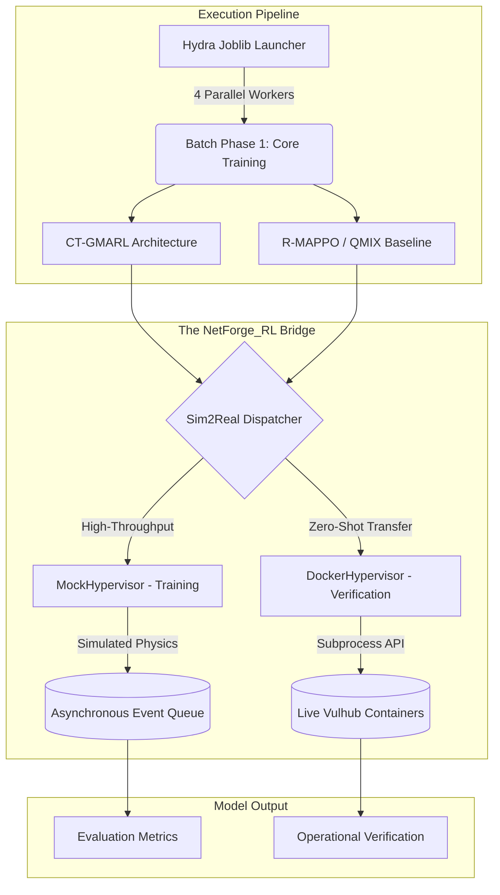
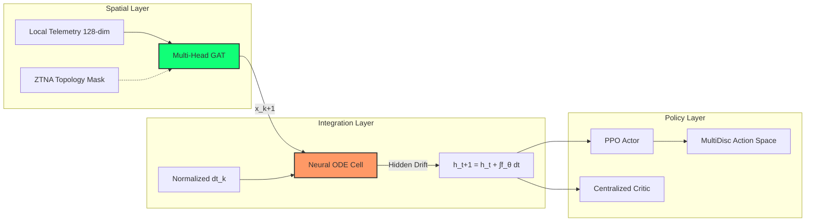

# Event-Driven Temporal Graph Networks for Asynchronous Multi-Agent Cyber Defense

[](https://opensource.org/licenses/MIT)
[](https://arxiv.org/abs/2604.09523)
[](https://gist.science/paper/2604.09523#gist)

A MARL framework for bridging the Sim2Real gap in autonomous cyber defense using **NetForge_RL** (an asynchronous POSMDP simulator) and **CT-GMARL** (a Continuous-Time ODE-based Graph architecture).

---

## Research Overview

The transition of Multi-Agent Reinforcement Learning (MARL) policies to operational Security Operations Centers (SOCs) is bottlenecked by the **Sim2Real gap**. Legacy simulators abstract network physics into synchronous discrete turns, failing to capture the event-driven nature of real-world telemetry. 

### Key Contributions:
1.  **NetForge_RL**: Transitions the domain from discrete POMDPs to continuous-time **POSMDPs** ($F(t|s,a)$).
2.  **CT-GMARL**: A spatial-temporal architecture that marries **Multi-Head Graph Attention (GAT)** for dynamic topology reasoning with **Neural ODEs** for continuous-time hidden state drift.
3.  **Sim2Real Bridge**: A dual-hypervisor engine allowing training in a high-throughput `MockHypervisor` ($\approx 10,000$ SPS) and Zero-Shot evaluation against live exploits in `DockerHypervisor` using real Vulhub containers.
4.  **Operational Fidelity**: Avoids "scorched earth" failure modes through precise reward shaping and NLP-encoded SIEM telemetry (TF-IDF/Transformer).

---

## Dual-Engine Simulation Flow

NetForge_RL allows models to learn fundamental cyber physics at high speeds in a simulated environment before strictly verifying performance retention against genuine, live-fire vulnerabilities.



---

## CT-GMARL Architecture

CT-GMARL decouples the spatial constraints of Zero-Trust topology from the temporal irregularities of event-driven SIEM telemetry.



---

## Project Structure

```bash
ct_gmarl/
├── conf/                    # Hydra Experiment Configurations
│   ├── algorithm/           # RL Algorithm hyperparams (PPO, QMIX)
│   ├── env/                 # NetForge_RL Environment settings (100-node)
│   ├── model/               # CT-GMARL architecture specific configs
│   └── research/            # Pre-configured experimental matrix runs
├── src/
│   ├── engine/              # NetForge_RL POSMDP Engine
│   │   ├── hypervisor/      # Mock vs. Docker Hypervisor logic
│   │   ├── suite.py         # ForgeSuite orchestration
│   │   └── telemetry.py     # SIEM NLP Log Encoding pipeline
│   ├── models/              # Neural Architecture Implementations
│   │   ├── ct_gmarl/        # Neural ODE + GAT Processor logic
│   │   └── baselines/       # R-MAPPO and QMIX implementations
│   └── utils/               # Metric export, logging, and seed management
├── diagrams/                # Exported training plots and action heatmaps
│   ├── ctg/                 # CT-GMARL specific heatmaps
│   └── rmappo/              # R-MAPPO baseline heatmaps
├── train.py                 # Primary entry point for training and evaluation
└── pyproject.toml           # Dependency and packaging management
```

---

## Quick Start

### 1. Installation
This project requires Python 3.12 and a running Docker daemon for Sim2Real evaluation.

```bash
git clone https://github.com/YourUsername/ct_gmarl.git
cd ct_gmarl
pip install . 
# Optional: install nlp transformers for BERT encoding
pip install ".[nlp]"
```

### 2. Running Experiments
We use **Hydra** for experiment configuration. You can launch the core training matrix directly from `train.py`.

```bash
# Launch CT-GMARL training on 100-node topology
python train.py algorithm=ct_gmarl env.node_count=100

# Launch competitive matrix (R-MAPPO vs CT-GMARL)
python train.py algorithm="[rmappo, ct_gmarl]" env.mode=sim

# Zero-Shot Sim2Real Evaluation (Requires Docker)
python train.py algorithm=ct_gmarl env.mode=real checkpoint=path/to/model
```

---

## Zero-Shot Sim2Real Transfer

We define **Zero-Shot Sim2Real Transfer** as evaluating the converged policy directly on live container payloads (DockerHypervisor) without any gradient updates or fine-tuning in the target environment. This verifies the agent's capacity to generalize topological and temporal defense logic trained in the MockHypervisor to genuine CVEs.

---

## Citation

If you use **NetForge_RL** or the **CT-GMARL** architecture in your research, please cite our work:

```bibtex
@misc{jankowski2026eventdriventemporalgraphnetworks,
      title={Event-Driven Temporal Graph Networks for Asynchronous Multi-Agent Cyber Defense in NetForge_RL}, 
      author={Igor Jankowski},
      year={2026},
      eprint={2604.09523},
      archivePrefix={arXiv},
      primaryClass={cs.LG},
      url={https://arxiv.org/abs/2604.09523}, 
}
```
